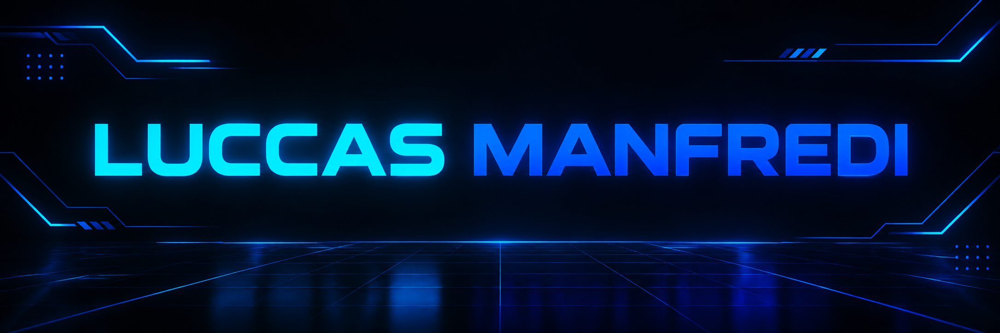

<div align="center">
    
</div>
## 🚀 Sobre mim

Sou estudante de desenvolvimento de software e estou construindo
minha experiência através de projetos práticos e atividades de programação.

Tenho interesse principalmente em:

- 🔧 Desenvolvimento Backend
- 🌐 Desenvolvimento Web
- 🐍 Python
- ⚡ JavaScript
- 🔌 IoT e ESP32
- 🔀 Git e GitHub
- 🗄️ Banco de dados e APIs

Meu objetivo é continuar evoluindo e transformar meus conhecimentos
em projetos cada vez mais completos e profissionais.

---

## 🛠️ Tecnologias

### 💻 Linguagens


### 🔧 Ferramentas


---

## 📚 Atualmente estudando

- 🐍 Python
- ⚡ JavaScript
- 🔙 Desenvolvimento Backend
- 🌐 APIs
- 🗄️ Banco de dados
- 🔀 Git e GitHub
- 🔌 ESP32 e IoT
- 🧠 Lógica de programação

---

## 🚀 Projetos

### 🅿️ Cancela Shopping

Sistema desenvolvido em Python para simular o funcionamento
de um sistema de estacionamento.

🔗 [Ver projeto](https://github.com/luccasmanfredi/Cancela_Shopping)

---

### 🚗 Veloria Hyperlux

Projeto de desenvolvimento web voltado para o segmento automotivo,
com foco em interface, apresentação visual e experiência do usuário.

🔗 [Ver projeto](https://github.com/luccasmanfredi/veloria-hyperlux)

---

### 🛡️ Site Segurança

Projeto web desenvolvido durante meus estudos, utilizando tecnologias
de desenvolvimento front-end.

🔗 [Ver projeto](https://github.com/luccasmanfredi/Site_Seguran-a)

---

### 🚘 Veloria

Projeto de desenvolvimento web relacionado ao segmento automotivo,
utilizando tecnologias front-end.

🔗 [Ver projeto](https://github.com/luccasmanfredi/veloria)

---

## 🎯 Objetivos

Atualmente meu foco é:

```text
Aprender
   ↓
Praticar
   ↓
Criar projetos
   ↓
Melhorar meus códigos
   ↓
Construir experiência
   ↓
Me tornar um desenvolvedor profissional
