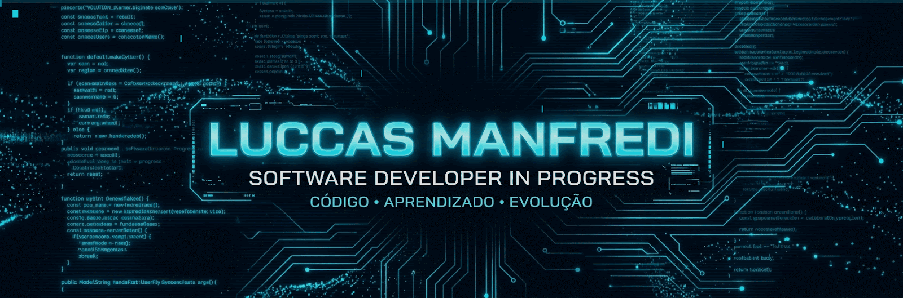

<!-- ========================================================= -->
<!--                    LUCCAS MANFREDI                        -->
<!--              CENTRO DE COMANDO DO DESENVOLVEDOR           -->
<!-- ========================================================= -->

<!-- 01 — HERO BANNER (ANIMADO) -->

  

<!-- ANIMAÇÃO DE TEXTO -->

  

<!-- 02 — STATUS -->

  
  
  
  

  
  
  

 

<!-- ========================================================= -->
<!--              03 — PERFIL DO DESENVOLVEDOR                 -->
<!-- ========================================================= -->
<h2 align="left"> Perfil do Desenvolvedor</h2>

<table width="100%">
  <tr>
    <td width="50%" valign="top">
      <h3 align="center">👤 Ficha do Desenvolvedor</h3>
      
<b>Desenvolvedor:</b> Luccas Manfredi

      
<b>FUNÇÃO:</b> Desenvolvedor de Software em Formação

      
<b>ESPECIALIZAÇÃO:</b> Backend e Desenvolvimento Web

      
<b>INSTITUIÇÃO:</b> SENAI — Desenvolvimento de Sistemas

      
<b>LOCALIZAÇÃO:</b> Brasil (BR)

    </td>
    <td width="50%" valign="top">
      <h3 align="center">📜 Painel de Missões</h3>
      
<b>[✓] MISSÃO PRINCIPAL:</b> Evoluir continuamente na construção de software.

      
<b>[✓] MISSÃO ATUAL:</b> Aprender, construir, testar e aprimorar código.

      
<b>[→] MISSÃO SECUNDÁRIA:</b> Integração Hardware/Software via ESP32 e IoT.

      
<b>[→] ARSENAL:</b> Python, JavaScript, Node.js, Web e SQL.

    </td>
  </tr>
</table>

 

<!-- ========================================================= -->
<!--                 04 — SOBRE MIM                            -->
<!-- ========================================================= -->
<h2 align="left">🚀 Sobre Mim</h2>

  Desenvolvedor em formação pelo <b>SENAI (Desenvolvimento de Sistemas)</b>, dedicado a estruturar uma base técnica sólida com foco principal em <b>Backend</b>, arquitetura de sistemas e soluções web.

  Minha trajetória abrange a criação de regras de negócio em <b>Python e Node.js</b>, estruturação de páginas e interfaces dinâmicas com <b>HTML5, CSS3 e JavaScript</b>, além de integração com bancos de dados relacionais. No campo dos sistemas embarcados, exploro a conectividade entre hardware e software via <b>ESP32 e MicroPython</b>.

  Acredito no aprendizado orientado à prática: entender o problema, codificar, enfrentar erros de execução, depurar e evoluir a cada repositório publicado.

  

<!-- ========================================================= -->
<!--            05 — FOCO ATUAL E STATUS                       -->
<!-- ========================================================= -->
<h2 align="left">⚡ Status do Sistema e Foco Atual</h2>

<table width="100%">
  <tr>
    <td width="30%"><b>Arquitetura Backend</b></td>
    <td></td>
  </tr>
  <tr>
    <td><b>Arquitetura Web (HTML/CSS)</b></td>
    <td></td>
  </tr>
  <tr>
    <td><b>Automação e Lógica com Python</b></td>
    <td></td>
  </tr>
  <tr>
    <td><b>Bancos de Dados e SQL Relacional</b></td>
    <td></td>
  </tr>
  <tr>
    <td><b>Sistemas IoT (ESP32)</b></td>
    <td></td>
  </tr>
</table>

 

<!-- ========================================================= -->
<!--                 06 — ARSENAL TECNOLÓGICO                  -->
<!-- ========================================================= -->
<h2 align="left">🧰 Arsenal Tecnológico</h2>

<table width="100%">
  <tr>
    <td width="25%" align="center" valign="top">
      <h4>⚙️ Backend</h4>
      
    </td>
    <td width="25%" align="center" valign="top">
      <h4>🌐 Web</h4>
      
    </td>
    <td width="25%" align="center" valign="top">
      <h4>🗄️ Dados e IoT</h4>
      
    </td>
    <td width="25%" align="center" valign="top">
      <h4>🛠️ Ferramentas</h4>
      
    </td>
  </tr>
</table>

 

<!-- ========================================================= -->
<!--              07 — PROJETOS EM DESTAQUE                    -->
<!-- ========================================================= -->
<h2 align="left">🏆 Projetos em Destaque</h2>

<table width="100%">
  <tr>
    <td width="50%" valign="top">
      <h3>🔥 <a href="https://github.com/luccasmanfredi/2TERMO">2TERMO</a></h3>
      
<b>DESCRIÇÃO:</b> Central de estudos e repositório principal da formação técnica no SENAI.

      
<b>O QUE PRATIQUEI:</b> Lógica de programação, comandos SQL, marcação web e versionamento contínuo.

      
<b>TECNOLOGIAS:</b> <code>JavaScript</code> • <code>HTML5</code> • <code>CSS3</code> • <code>MySQL</code> • <code>Git</code>

      
<b>STATUS:</b> Repositório Acadêmico

    </td>
    <td width="50%" valign="top">
      <h3>🏭 Catálogo de Fornecedores</h3>
      
<b>DESCRIÇÃO:</b> Aplicação web industrial construída em equipe com papéis definidos (PO, Scrum Master e Devs).

      
<b>O QUE PRATIQUEI:</b> Metodologia Scrum, trabalho em equipe, estruturação de páginas e rotas.

      
<b>TECNOLOGIAS:</b> <code>HTML5</code> • <code>CSS3</code> • <code>JavaScript</code> • <code>Scrum</code>

      
<b>STATUS:</b> Projeto Acadêmico Concluído

    </td>
  </tr>
  <tr>
    <td width="50%" valign="top">
       
      <h3>🏎️ <a href="https://github.com/luccasmanfredi/Veloria-Hyperlux">Veloria / Hyperlux</a></h3>
      
<b>DESCRIÇÃO:</b> Interface web dedicada à apresentação visual de veículos e conceito de catálogo de alto padrão.

      
<b>O QUE PRATIQUEI:</b> Layouts responsivos, estilização avançada com CSS3 e interatividade com JavaScript.

      
<b>TECNOLOGIAS:</b> <code>HTML5</code> • <code>CSS3</code> • <code>JavaScript</code>

      
<b>STATUS:</b> Publicado

    </td>
    <td width="50%" valign="top">
       
      <h3>👾 <a href="https://github.com/luccasmanfredi/site-seguranca">DEVTECH — Cibersegurança</a></h3>
      
<b>DESCRIÇÃO:</b> Portal web focado na disseminação de conceitos de segurança da informação e tecnologia.

      
<b>O QUE PRATIQUEI:</b> Estruturação semântica de conteúdo web, usabilidade e estilização.

      
<b>TECNOLOGIAS:</b> <code>HTML5</code> • <code>CSS3</code>

      
<b>STATUS:</b> Publicado

    </td>
  </tr>
  <tr>
    <td width="50%" valign="top">
       
      <h3>🅿️ <a href="https://github.com/luccasmanfredi/Cancela-Shopping">Sistema de Estacionamento</a></h3>
      
<b>DESCRIÇÃO:</b> Algoritmo de controle para acesso, permanência, validação de vagas e tarifação.

      
<b>O QUE PRATIQUEI:</b> Estruturas de controle, funções, tratamento de regras de negócio e validação de dados.

      
<b>TECNOLOGIAS:</b> <code>Python</code>

      
<b>STATUS:</b> Concluído

    </td>
    <td width="50%" valign="top">
       
      <h3>🛒 Golden Nexus AI</h3>
      
<b>DESCRIÇÃO:</b> Conceito de interface para e-commerce com elementos visuais tecnológicos.

      
<b>O QUE PRATIQUEI:</b> Componentização visual, estilização moderna e prototipagem front-end.

      
<b>TECNOLOGIAS:</b> <code>HTML5</code> • <code>CSS3</code> • <code>JavaScript</code>

      
<b>STATUS:</b> Conceito Concluído

    </td>
  </tr>
</table>

 

<!-- ========================================================= -->
<!--                  08 — LABORATÓRIO IOT                     -->
<!-- ========================================================= -->
<h2 align="left">🔌 Laboratório de IoT e Controle de Sistemas</h2>

Testes e desenvolvimento de automação conectando hardware e software através do microcontrolador <b>ESP32</b> e linguagem <b>MicroPython</b>.

<table width="100%">
  <tr>
    <td align="center">
      
<b>FLUXO DE EXECUÇÃO DO HARDWARE</b>

      <code>[ SENSOR DE LUZ (Pino D5) ]</code> ➔ 
      <code>[ SENSOR DE TEMP (Pino D19) ]</code> ➔ 
      <code>[ LÓGICA ESP32 ]</code> ➔ 
      <code>[ ATUADOR / LED (Pino D4) ]</code>
    </td>
  </tr>
</table>

 

<!-- ========================================================= -->
<!--            09 — JORNADA DE DESENVOLVIMENTO                -->
<!-- ========================================================= -->
<h2 align="left">📈 Jornada de Desenvolvimento</h2>

  <code>Lógica de Programação</code> ➔ 
  <code>Python</code> ➔ 
  <code>JavaScript</code> ➔ 
  <code>HTML5 e CSS3</code> ➔ 
  <code>Desenvolvimento Web</code> ➔ 
  <code>Node.js</code> ➔ 
  <code>APIs</code> ➔ 
  <code>Bancos de Dados</code> ➔ 
  <code>Backend</code> ➔ 
  <code>IoT / ESP32</code> ➔ 
  <code>Evolução Contínua</code>

 

<!-- ========================================================= -->
<!--             10 — APRENDENDO ATUALMENTE                    -->
<!-- ========================================================= -->
<h2 align="left">🧠 Aprendendo Atualmente</h2>

<table width="100%">
  <tr>
    <td width="20%" align="center"><b>Lógica Backend</b> <code>[ EM CONSTRUÇÃO ]</code></td>
    <td width="20%" align="center"><b>APIs RESTful</b> <code>[ EXPLORANDO ]</code></td>
    <td width="20%" align="center"><b>Node.js / Web</b> <code>[ EXPLORING ]</code></td>
    <td width="20%" align="center"><b>MySQL / Queries</b> <code>[ APRENDENDO ]</code></td>
    <td width="20%" align="center"><b>ESP32 / MicroPython</b> <code>[ ATIVO ]</code></td>
  </tr>
</table>

 

<!-- ========================================================= -->
<!--                 11 — ROADMAP / PLANO                      -->
<!-- ========================================================= -->
<h2 align="left">🗺️ Plano de Estudos</h2>

<ul>
  <li><b>Fase 1 (Fundamentos Acadêmicos):</b> Consolidação de algoritmos, lógica de programação, versionamento com Git e marcação web.</li>
  <li><b>Fase 2 (Foco Atual):</b> Construção de serviços backend em Node.js, integrações de APIs, manipulação de bancos de dados SQL e scripts em Python.</li>
  <li><b>Fase 3 (Sistemas Conectados):</b> Integração de hardware via ESP32 com MicroPython e leitura de dados via sensores.</li>
  <li><b>Fase 4 (Objetivo Profissional):</b> Aprofundamento em boas práticas, arquiteturas escaláveis de servidor e desenvolvimento de software.</li>
</ul>

 

<!-- ========================================================= -->
<!--             12 — ESTATÍSTICAS DO GITHUB                   -->
<!-- ========================================================= -->
<h2 align="left">📊 Estatísticas do GitHub</h2>

  
  

 

<!-- ========================================================= -->
<!--           13 — GRÁFICO DE CONTRIBUIÇÕES                   -->
<!-- ========================================================= -->
<h2 align="left">📈 Gráfico de Contribuições</h2>

  

<!-- ========================================================= -->
<!--            14 — FILOSOFIA DE DESENVOLVIMENTO              -->
<!-- ========================================================= -->
<h2 align="left">⚡ Filosofia de Desenvolvimento</h2>

<blockquote>
  <i>"Programar é um processo contínuo de aprendizado prático. Cada erro de compilação ou falha de lógica é uma oportunidade de entender o comportamento do sistema, refatorar o código e construir soluções cada vez melhores."</i>
</blockquote>

 

<!-- ========================================================= -->
<!--               15 — CONECTE-SE COMIGO                      -->
<!-- ========================================================= -->
<h2 align="left">🌐 Conecte-se Comigo</h2>

  
  
  

 

<!-- ========================================================= -->
<!--                   16 — RODAPÉ                             -->
<!-- ========================================================= -->

  

  <b>⚡ LUCCAS MANFREDI • CÓDIGO • APRENDIZADO • EVOLUÇÃO ⚡</b>

